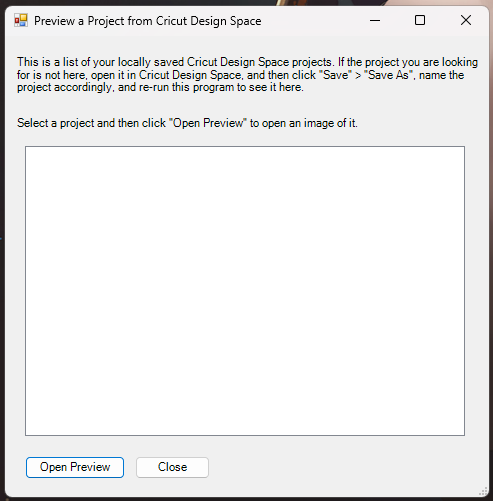

# cricut-preview

Preview locally saved Cricut Design Space projects. Windows OS only.

## Setup

Go to the [Releases tab](https://github.com/andria-dev/cricut-preview/releases) and download the latest `.exe` file to your preferred location (e.g. Desktop). Run the file (double-click) and follow the in-app instructions.

